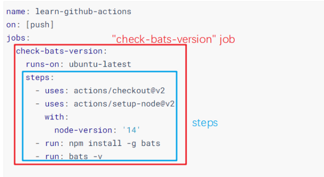
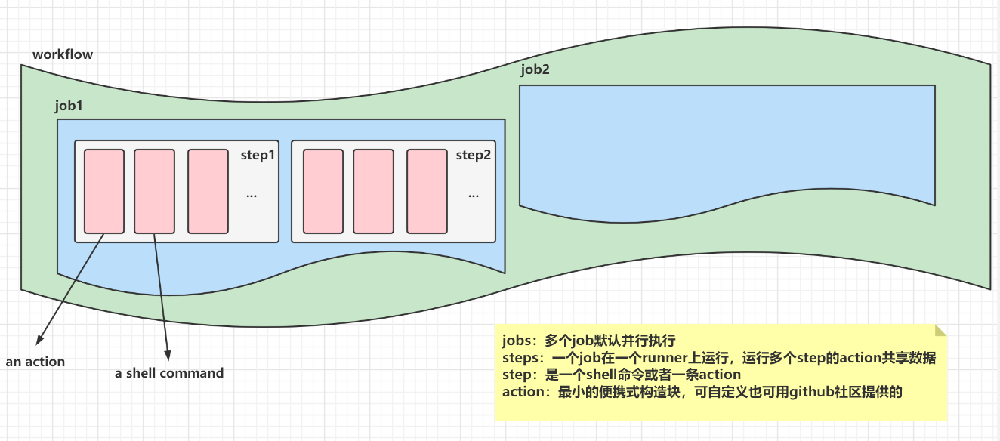

# workflow
use github workflow

官方文档 https://docs.github.com/en/actions/learn-github-actions/introduction-to-github-actions


`workflow`：有一个或多个 job 组成，由事件触发或调度

- `event`：https://docs.github.com/en/actions/reference/events-that-trigger-workflows

`job`：有一个或多个 step 组成，这个 step 集合运行在一个 runner 上。一个包含多个 job 的 workflow 会并行运行在多个 runner 上。也可以配置 workflow 的多个 job 串行执行。

`step`：独立的任务集合，each step is a separate action or shell command。一个 job 在一个runner上运行，运行多个 step 的 action 共享数据。

- `action`：smallest portable building block of a workflow. 使用时必须把它当作一个 step 。








示例程序：

```yaml
# This is a basic workflow to help you get started with Actions

name: CI

# Controls when the workflow will run
on:
  # Triggers the workflow on push or pull request events but only for the master branch
  push:
    branches: [ master ]
  pull_request:
    branches: [ master ]

  # Allows you to run this workflow manually from the Actions tab
  workflow_dispatch:

# A workflow run is made up of one or more jobs that can run sequentially or in parallel
jobs:
  # This workflow contains a single job called "build"
  build:
    # The type of runner that the job will run on
    runs-on: ubuntu-latest

    # Steps represent a sequence of tasks that will be executed as part of the job
    steps:
      # Checks-out your repository under $GITHUB_WORKSPACE, so your job can access it
      - uses: actions/checkout@v2

      # Runs a single command using the runners shell
      - name: Run a one-line script
        run: echo Hello, world!

      # Runs a set of commands using the runners shell
      - name: Run a multi-line script
        run: |
          echo Add other actions to build,
          echo test, and deploy your project.

```


https://docs.github.com/en/actions/learn-github-actions/introduction-to-github-actions#create-an-example-workflow

```yaml
name: learn-github-actions
on: [push]
jobs:
  check-bats-version:
    runs-on: ubuntu-latest
    steps:
      - uses: actions/checkout@v2
      - uses: actions/setup-node@v2
        with:
          node-version: '14'
      - run: npm install -g bats
      - run: bats -v

```


